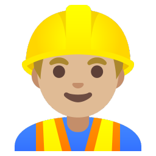

# 👥 Contributors

## تهیه‌کننده اولیه
- (https://github.com/Rezomoon/)

## مشارکت‌کنندگان


# 🤝 نحوه مشارکت در ubuntu-learning-notes

ممنون که می‌خوای به این پروژه کمک کنی! 🎉  
این پروژه کاملاً **باز و مشارکتی** است و هر تجربه واقعی از یادگیری اوبونتو (حتی یک کامند یا نکته کوچک) رو خوشحال می‌شیم اضافه کنی.

## 📋 مراحل مشارکت (خیلی ساده)

1. ریپو رو **فورک** کن (دکمه Fork بالا سمت راست)
2. یک برنچ جدید بساز (اسمش رو واضح بگذار، مثلاً `feat/add-ssh-section`)
3. تغییراتت رو انجام بده
4. کامیت بزن با پیام واضح (مثل `docs: اضافه شدن بخش SSH`)
5. Pull Request بزن و توضیح بده چی اضافه کردی

## 🚀 چه چیزهایی می‌تونی اضافه کنی؟
- بخش جدید در پوشه `docs/` (با شماره‌گذاری درست)
- بهبود جدول کامندها یا توضیحات
- اضافه کردن نکات عملی، مثال واقعی یا اسکرین‌شات در پوشه `images/`
- تصحیح غلط املایی، فنی یا لینک شکسته
- اضافه کردن منابع جدید در پوشه `resources/`
- پیشنهاد ویژگی یا گزارش مشکل (از طریق Issues)

## 📝 قوانین نوشتاری (سبک ما)
- زبان: **فارسی روان و ساده**
- برای کامندها همیشه از **جدول** استفاده کن (مثل فایل `commands.md`)
- هر فایل در انتها داشته باش:
  ```markdown
  **آخرین ویرایش:** ۱۴۰۴/۰۲/۰۱  
  **توسط:** نام تو + نام contributor جدید
  تصاویر رو در images/ بگذار و با مسیر نسبی استفاده کن
از Markdown استاندارد گیت‌هاب استفاده کن

🛠 گزارش مشکل یا پیشنهاد (Issues)

به قسمت Issues برو و عنوان واضح بنویس
برچسب (Label) مناسب انتخاب کن: enhancement یا bug یا question

👥 Contributors
همه کسانی که کمک کنن، اسم و لینک گیت‌هابشون در فایل CONTRIBUTORS.md ذکر می‌شه.
کد رفتار (Code of Conduct)

احترام متقابل، بدون توهین
انتقاد سازنده از محتوا، نه از شخص
همه اینجا برای یادگیری هستیم ❤️


سوال یا مشکلی داشتی؟
Issue باز کن یا توی Discussions بپرس.
خوشحال می‌شیم با هم بهترین مرجع فارسی اوبونتو رو بسازیم! 🚀